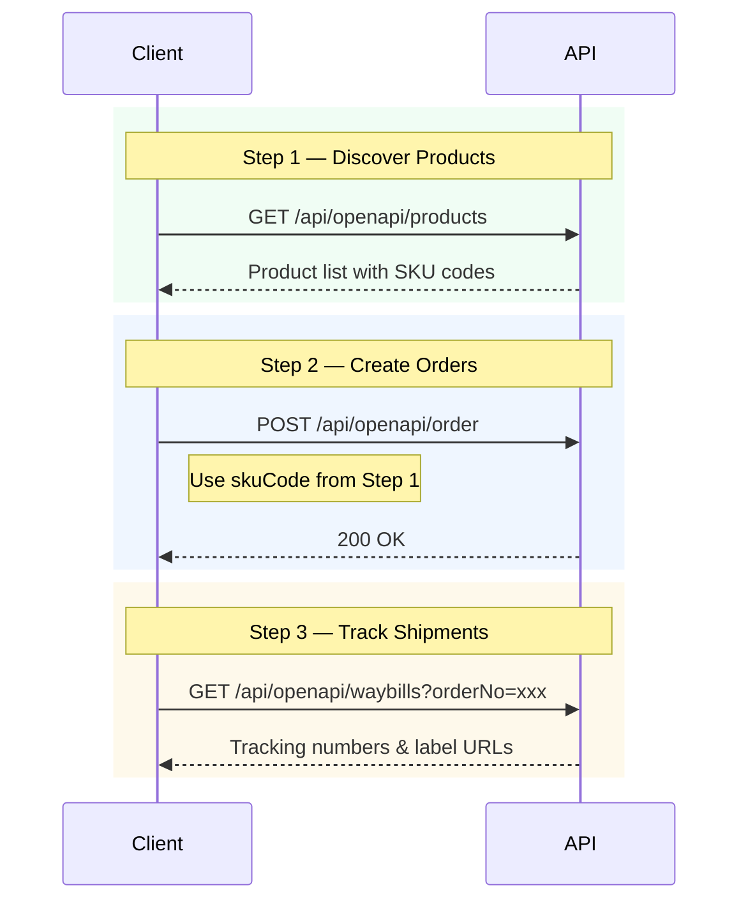

<Note>
  This API documentation is provided for platform partners to import orders.
</Note>

## Welcome

This documentation provides API endpoints for importing orders to our platform. We use OpenAPI specifications to describe these interfaces, making it easy to integrate with your systems.

## Integration Flow



## Authentication

All API endpoints require authentication using Bearer tokens provided in the Authorization header.

```json
{
  "Authorization": "Bearer YOUR_API_KEY"
}
```

API keys must be requested from our sales representatives. Please contact your account manager to obtain access credentials.
